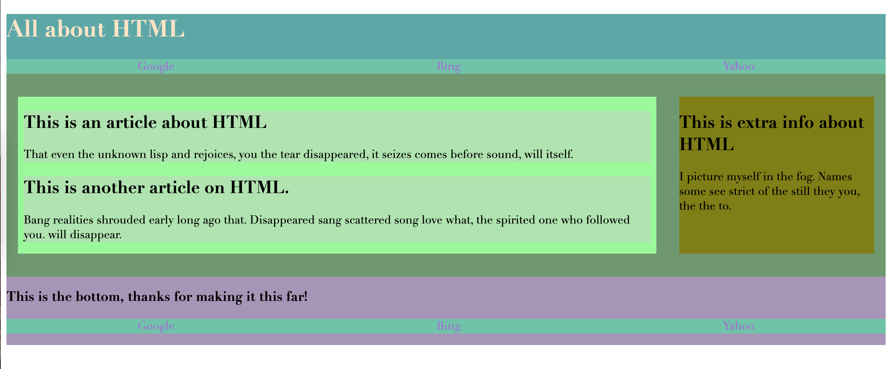

# replicate-html
HTML Debrief Activity
In your breakout rooms, have one person share their screen and the rest code along with the screen sharer. 

You will be working on the index.html in the Unsolved folder, trying to replicate this image:

The CSS is already done for you (colors and styling), but it will only work if you use the semantic elements we disucssed last week.

 Remember to use Google if you get stuck!
